# 🚀 **Ultra Platform - Next-Generation Solana DeFi Ecosystem**

<div align="center">


**An enterprise-grade DeFi platform combining AI-powered analytics, real-time portfolio management, and advanced trading on Solana**

[🌟 Features](#features) • [🏗️ Architecture](#architecture) • [🚀 Quick Start](#quick-start) • [📚 Documentation](#documentation) • [🔧 Development](#development)

</div>

---

## 🎯 **What is Ultra Platform?**

Ultra Platform is a sophisticated DeFi application that revolutionizes how users interact with the Solana ecosystem. It combines cutting-edge AI analytics, real-time portfolio tracking, and advanced trading capabilities into a seamless, enterprise-grade platform.

### **🌟 Key Highlights**

- **AI-Powered Intelligence**: DeepSeek AI integration for market analysis and portfolio optimization
- **Real-Time Everything**: Live price feeds, portfolio updates, and transaction monitoring
- **Multi-Wallet Support**: Phantom, Solflare, Backpack, and Glow wallet integration
- **Advanced Trading**: Jupiter DEX integration with MEV protection
- **Enterprise Architecture**: Microservices with API Gateway orchestration
- **Modern UI/UX**: Next.js 14 with beautiful, responsive design

---

## 🌟 **Features**

### **💼 Portfolio Management**
- **Real-time portfolio tracking** with multi-source price aggregation
- **Advanced analytics** including risk assessment and diversification scores
- **AI-powered insights** and optimization recommendations
- **Historical performance** tracking and P&L analysis
- **Asset allocation** visualization and rebalancing suggestions

### **🤖 AI Intelligence**
- **DeepSeek AI integration** for advanced market analysis
- **Portfolio optimization** with AI-driven recommendations
- **Risk assessment** algorithms and sentiment analysis
- **Price predictions** and trading signal generation
- **Market trend analysis** and opportunity identification

### **⚡ Advanced Trading**
- **Jupiter DEX integration** for optimal swap routing
- **Real-time price charts** and market data
- **MEV protection** and transaction simulation
- **Multiple order types** and advanced trading features
- **Slippage optimization** and execution analytics

### **🔗 Wallet Integration**
- **Multi-wallet support** (Phantom, Solflare, Backpack, Glow)
- **Secure connection management** with signature verification
- **Balance tracking** across all tokens and LP positions
- **Transaction monitoring** and history tracking
- **Staking and yield farming** position management

### **📊 Analytics Dashboard**
- **Comprehensive portfolio analytics** with interactive charts
- **Risk management tools** and concentration analysis
- **Yield optimization** tracking and APY calculations
- **Performance benchmarking** and comparison tools
- **Market overview** and token analysis

---

## 🏗️ **Architecture**

### **System Overview**

```mermaid
graph TB
    User[👤 User Browser] --> Frontend[🖥️ Frontend<br/>Next.js 14 + React 18]
    Frontend --> Gateway[🌐 API Gateway<br/>Port 3001]
    
    Gateway --> Wallet[💰 Wallet Service<br/>Port 3005]
    Gateway --> AI[🤖 AI Intelligence<br/>Port 3002]
    Gateway --> Swap[⚡ Swap Engine<br/>Port 3003]
    
    Wallet --> Solana[🔗 Solana RPC]
    AI --> DeepSeek[🧠 DeepSeek API]
    Swap --> Jupiter[🪐 Jupiter DEX]
    
    Gateway --> Redis[(📊 Redis Cache)]
    Wallet --> Redis
    AI --> Redis
```



### **🛠️ Technology Stack**

| **Layer** | **Technology** | **Purpose** |
|-----------|----------------|-------------|
| **Frontend** | Next.js 14, React 18, TypeScript | Modern web application |
| **State Management** | Zustand, TanStack Query | Client state and server data |
| **UI/UX** | Tailwind CSS, Framer Motion, Radix UI | Responsive design and animations |
| **Backend** | Node.js 20+, Fastify, TypeScript | High-performance API services |
| **Database/Cache** | Redis 7+, JSON storage | Caching and session management |
| **Blockchain** | Solana Web3.js, Wallet Adapter | Blockchain connectivity |
| **External APIs** | DeepSeek, CoinGecko, Jupiter, Birdeye | AI and market data |
| **Infrastructure** | Docker, PM2, Nginx | Deployment and orchestration |

### **📁 Project Structure**

```
ultra-platform/
├── 🖥️ frontend/                    # Next.js Application
│   ├── app/                        # App Router (Next.js 14)
│   ├── components/                 # React Components
│   │   ├── portfolio/              # Portfolio analytics
│   │   ├── trading/                # Trading interface
│   │   ├── analytics/              # AI analytics dashboard
│   │   ├── dashboard/              # Main dashboard
│   │   └── layout/                 # Layout components
│   ├── stores/                     # Zustand state management
│   └── hooks/                      # Custom React hooks
│
├── ⚙️ services/                     # Backend Microservices
│   ├── api-gateway/                # Main API Gateway
│   ├── wallet-service/             # Wallet & Portfolio
│   ├── ai-intelligence/            # AI Analytics
│   ├── swap-engine/                # Trading Engine
│   └── shared/                     # Shared utilities
│
├── 📚 docs/                        # Documentation
├── 🐳 docker-compose.yml           # Container orchestration
└── 📦 package.json                 # Workspace configuration
```

---

## 🚀 **Quick Start**

### **Prerequisites**

```bash
Node.js 20+ LTS
npm 10+
Redis 7+
Git
```

### **1. Installation**

```bash
# Clone the repository
git clone https://github.com/your-org/ultra-platform.git
cd ultra-platform

# Install dependencies
npm install --legacy-peer-deps

# Install services individually if workspace issues occur
cd shared && npm install && npm run build
cd ../services/api-gateway && npm install
cd ../ai-intelligence && npm install
cd ../swap-engine && npm install
cd ../wallet-service && npm install
cd ../../frontend && npm install
```

### **2. Environment Setup**

```bash
# Copy environment files
cp .env.example .env
cp frontend/.env.example frontend/.env.local

# Configure environment variables
nano .env
```

**Required Environment Variables:**

```env
# Core Configuration
NODE_ENV=development
REDIS_URL=redis://localhost:6379

# Blockchain
SOLANA_RPC_URL=https://api.mainnet-beta.solana.com

# External APIs
DEEPSEEK_API_KEY=your-deepseek-api-key
COINGECKO_API_KEY=your-coingecko-key

# Service URLs (development)
NEXT_PUBLIC_API_URL=http://localhost:3001
NEXT_PUBLIC_WS_URL=ws://localhost:3001
```

### **3. Development Server**

```bash
# Start Redis
sudo systemctl start redis-server

# Start all services
npm run dev

# Services will be available at:
# Frontend:    http://localhost:3000
# API Gateway: http://localhost:3001
# AI Service:  http://localhost:3002
# Swap Engine: http://localhost:3003
# Wallet:      http://localhost:3005
```

### **4. Health Check**

```bash
# Check system health
curl http://localhost:3001/api/v1/health

# Check individual services
curl http://localhost:3002/health  # AI Service
curl http://localhost:3005/health  # Wallet Service
```

---

## 🔌 **API Documentation**

### **API Gateway Routes**

| **Endpoint** | **Method** | **Description** |
|--------------|------------|-----------------|
| `/api/v1/health` | GET | System health status |
| `/api/v1/wallet/:address/portfolio` | GET | Portfolio data |
| `/api/v1/ai/analyze/portfolio` | POST | AI portfolio analysis |
| `/api/v1/swap/quote` | POST | Get swap quote |
| `/api/v1/swap/execute` | POST | Execute swap |
| `/ws/portfolio/:address` | WS | Real-time portfolio updates |
| `/ws/prices` | WS | Live price feeds |

### **WebSocket Events**

```typescript
// Portfolio Updates
{
  type: 'PORTFOLIO_UPDATE',
  data: {
    totalValue: 125420.50,
    change24h: 5.2,
    positions: [...],
    lastUpdated: '2025-01-06T10:30:00Z'
  }
}

// Price Updates
{
  type: 'PRICE_UPDATE',
  data: {
    token: 'SOL',
    price: 206.31,
    change24h: 8.5,
    timestamp: 1641461400000
  }
}
```

---

## 💡 **Core Features Deep Dive**

### **🤖 AI Intelligence Engine**

The AI Intelligence service leverages DeepSeek API to provide:

- **Portfolio Analysis**: Risk assessment, diversification scoring, and optimization
- **Market Predictions**: Price forecasting and trend analysis
- **Trading Signals**: Buy/sell recommendations based on market conditions
- **Sentiment Analysis**: Market sentiment tracking and news analysis

**Example AI Analysis:**

```typescript
const analysis = await fetch('/api/v1/ai/analyze/portfolio', {
  method: 'POST',
  headers: { 'Content-Type': 'application/json' },
  body: JSON.stringify({
    portfolio: {
      totalValue: 125420.50,
      positions: [...]
    }
  })
});
```

### **📊 Real-Time Portfolio Tracking**

Advanced portfolio management with:

- **Multi-source price aggregation** (CoinGecko, Birdeye, DexScreener)
- **Real-time balance updates** via WebSocket connections
- **Historical performance tracking** and P&L calculations
- **Risk metrics** including concentration risk and portfolio beta

### **⚡ Advanced Trading Engine**

Sophisticated trading capabilities:

- **Jupiter DEX integration** for optimal routing
- **MEV protection** and transaction simulation
- **Slippage optimization** and execution analytics
- **Multiple order types** and advanced trading features

---

## 🔧 **Development Guide**

### **Adding New Features**

1. **Backend Service**: Create new service in `services/` directory
2. **API Gateway**: Add route proxying in `api-gateway/src/routes.ts`
3. **Frontend Component**: Add component in `frontend/components/`
4. **State Management**: Extend Zustand stores as needed

### **Development Standards**

- **TypeScript Strict Mode**: All code must pass strict TypeScript compilation
- **API-First Development**: Frontend components consume real APIs
- **Error Boundaries**: Comprehensive error handling at all layers
- **Real-time Architecture**: WebSocket integration for live data

### **Testing Strategy**

```bash
# Unit tests
npm run test

# Integration tests
npm run test:integration

# E2E tests
npm run test:e2e

# Type checking
npm run typecheck
```

---

## 🚀 **Deployment**

### **Development Deployment**

```bash
# Using Docker Compose
docker-compose up -d

# Using PM2
pm2 start ecosystem.config.js
```

### **Production Deployment**

```bash
# Build all services
npm run build

# Production start
npm run start:prod

# Health monitoring
npm run health
```

### **Environment-Specific Configurations**

- **Development**: Local Redis, mock data integration
- **Staging**: Cloud Redis, real API integration
- **Production**: High-availability setup, monitoring, logging

---

## 📚 **Documentation**

### **Available Documentation**

- [**Architecture Guide**](./docs/ARCHITECTURE.md) - Complete system architecture
- [**API Reference**](./docs/API.md) - Comprehensive API documentation
- [**Deployment Guide**](./docs/DEPLOYMENT.md) - Production deployment instructions
- [**Development Setup**](./docs/DEVELOPMENT.md) - Developer environment setup
- [**Troubleshooting**](./docs/TROUBLESHOOTING.md) - Common issues and solutions

### **Team Resources**

- [**Developer Handoff**](./COMPLETE_DEVELOPER_HANDOFF.md) - Complete project handoff
- [**Production Rules**](./PRODUCTION_DEPLOYMENT_RULES.md) - Deployment best practices
- [**Project Architecture**](./PROJECT_ARCHITECTURE.md) - Technical architecture overview

---

## 🤝 **Contributing**

### **Development Workflow**

1. **Fork the repository**
2. **Create feature branch**: `git checkout -b feature/amazing-feature`
3. **Commit changes**: `git commit -m 'Add amazing feature'`
4. **Push to branch**: `git push origin feature/amazing-feature`
5. **Open Pull Request**

### **Code Standards**

- Follow TypeScript strict mode guidelines
- Use conventional commit messages
- Add tests for new features
- Update documentation as needed

---

## 📞 **Support & Community**

### **Getting Help**

- **Documentation**: Check the [docs folder](./docs/)
- **Issues**: Open a GitHub issue for bugs or feature requests
- **Discussions**: Join community discussions for general questions

### **Team Contact**

- **Technical Lead**: Architecture and integration questions
- **Frontend Team**: UI/UX and React component questions
- **Backend Team**: API and service architecture questions

---

## 📈 **Roadmap**

### **Current Version (3.0.0)**
- ✅ Multi-wallet Solana integration
- ✅ AI-powered portfolio analytics
- ✅ Real-time trading capabilities
- ✅ Advanced portfolio management

### **Upcoming Features**
- 🔄 Cross-chain support (Ethereum, Polygon)
- 🔄 Advanced order types (limit, stop-loss)
- 🔄 Social trading features
- 🔄 Mobile application (React Native)

---

## 📄 **License**

This project is licensed under the MIT License - see the [LICENSE](LICENSE) file for details.

---

<div align="center">

**Built with ❤️ by the Ultra Platform Team**

[🌟 Star on GitHub](https://github.com/your-org/ultra-platform) • [🐛 Report Bug](https://github.com/your-org/ultra-platform/issues) • [💡 Request Feature](https://github.com/your-org/ultra-platform/issues)

</div>
